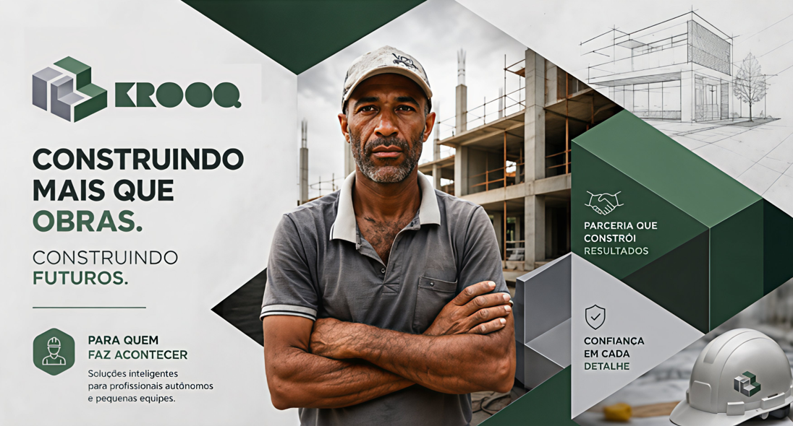
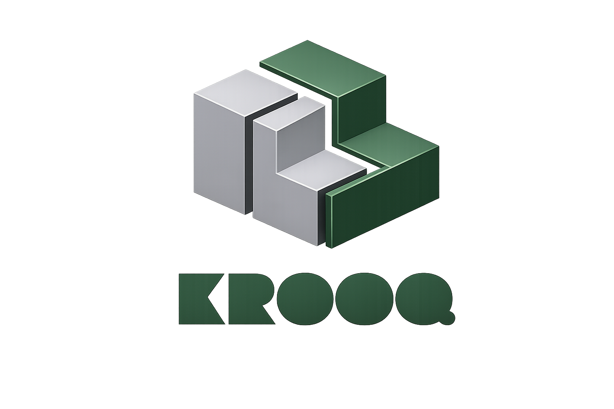
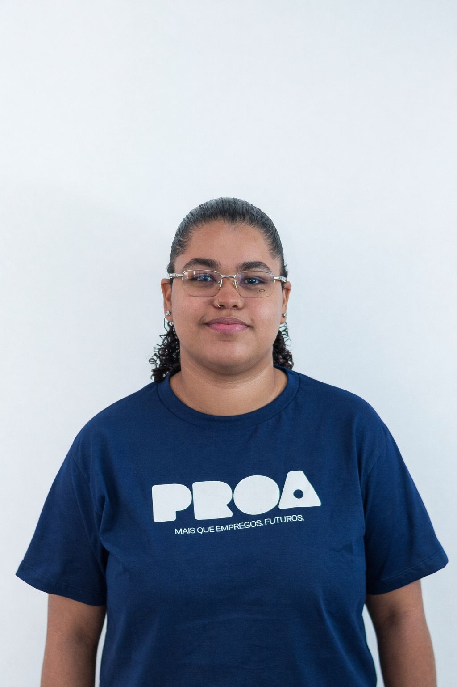
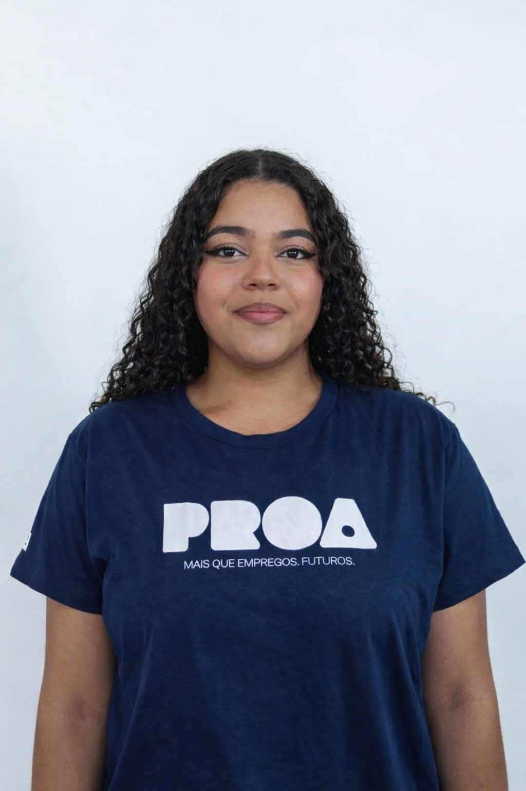
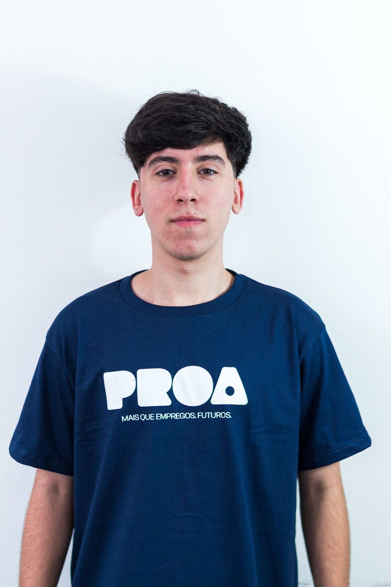
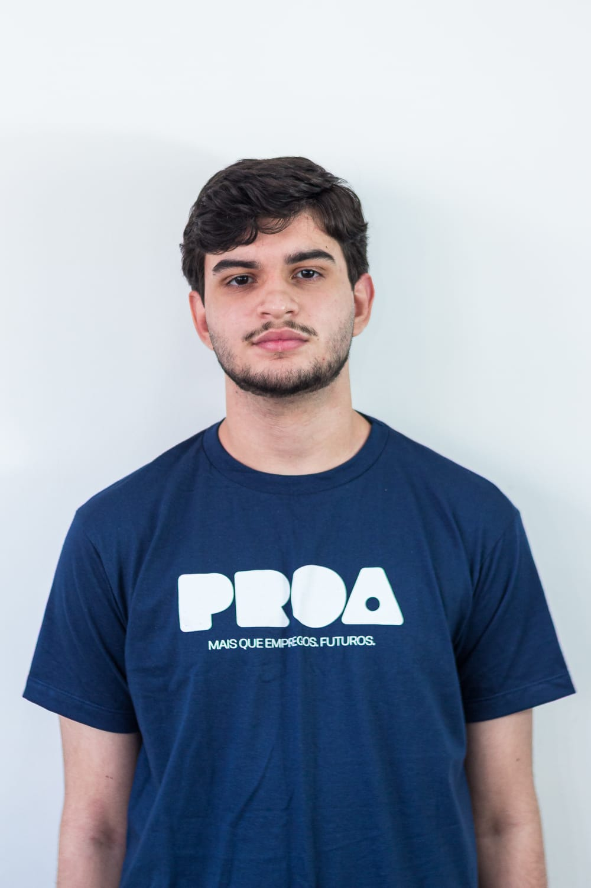
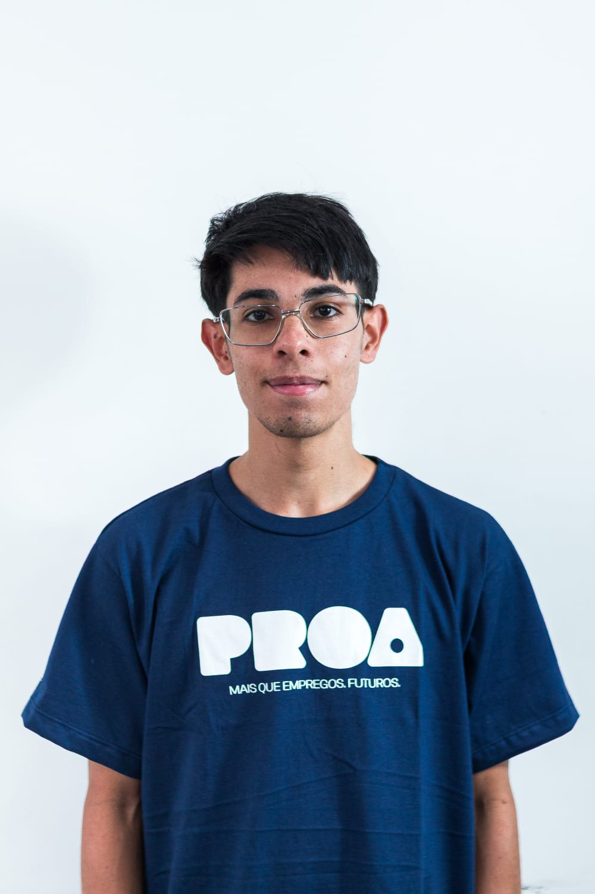
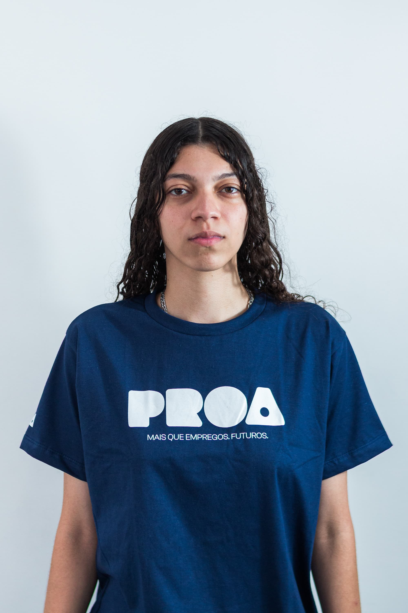
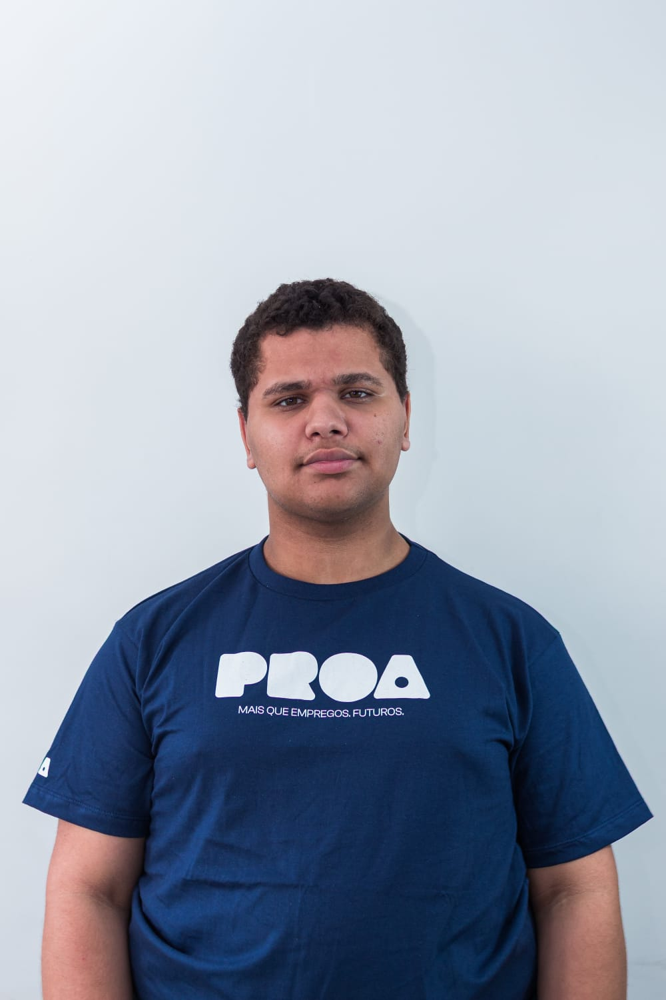

# KROOQ

### Simplificando obras, conectando pessoas.

Uma plataforma inteligente para gestão de obras que centraliza pessoas, processos e informações em um único ambiente.

  
  

---

<h2 align="center">📖 Sobre a Krooq</h2>

A Krooq é uma plataforma inteligente para gestão de obras que conecta clientes, profissionais e informações em um único ambiente digital.

Criada para solucionar problemas recorrentes na construção civil, como falhas de comunicação, falta de organização e dificuldade no acompanhamento das obras, a plataforma centraliza todas as etapas do projeto em um só lugar, proporcionando mais controle, transparência e eficiência durante toda a execução.

Além de gerenciar projetos, prazos, custos, documentos e equipes, a Krooq utiliza Inteligência Artificial para apoiar o planejamento da obra, gerar visualizações em 3D, estimar custos e auxiliar na tomada de decisões antes mesmo do início da execução.

Nossa missão é transformar a forma como obras e reformas são gerenciadas, tornando a experiência mais simples, conectada, organizada e acessível para todos os envolvidos.

---

<h2 align="center">✨ Principais Funcionalidades</h2>

- 🤖 Inteligência Artificial para criação de imagens e custo estimado
- 🏗️ Gestão completa de projetos e obras
- 👷 Conexão entre clientes e profissionais
- 📋 Gerenciamento de tarefas e etapas
- 📊 Acompanhamento em tempo real
- 💰 Controle e estimativa de custos
- 📁 Centralização de documentos e informações
- 📸 Registro da evolução da obra
- ⭐ Sistema de avaliações entre clientes e profissionais
- 📈 Histórico completo de cada projeto

---

<h2 align="center">🎯 Missão</h2>

Transformar a forma como a construção civil é gerenciada, centralizando comunicação, processos e informações em uma única plataforma, proporcionando mais transparência, organização, produtividade e confiança para todos os envolvidos em uma obra.

---

<h2 align="center">👁️ Visão</h2>

Ser o principal ecossistema digital da construção civil, conectando clientes, profissionais e tecnologia para simplificar toda a jornada de uma obra, desde o planejamento até a entrega, promovendo inovação e eficiência no setor.

---

<h2 align="center">💚 Valores</h2>

<table align="center">
<tr>
<td align="center" width="180">

### 🔍 Clareza
Informações transparentes e organizadas durante toda a obra.

</td>

<td align="center" width="180">

### 🤝 Conexão
Integramos clientes, profissionais e projetos em um único ambiente.

</td>

<td align="center" width="180">

### 📈 Crescimento
Impulsionamos o desenvolvimento de pessoas e negócios.

</td>
</tr>

<tr>
<td align="center">

### 🌎 Diversidade
Criamos oportunidades para todos os profissionais.

</td>

<td align="center">

### 💡 Inovação
Tecnologia e IA para transformar a construção civil.

</td>

<td align="center">

### 🛡️ Transparência
Mais confiança em todas as etapas da obra.

</td>
</tr>
</table>

---

<h2 align="center">🚀 Nosso Diferencial</h2>

A <strong>Krooq</strong> vai além de uma plataforma de gestão.

Nossa solução integra <strong>Inteligência Artificial</strong>, gestão de obras e conexão entre clientes e profissionais em um único ambiente digital.

Desde a concepção da ideia até a entrega da obra, oferecemos recursos para planejamento inteligente, visualização em 3D, estimativa de custos, acompanhamento da execução, registro do histórico da obra e comunicação centralizada, proporcionando uma experiência mais eficiente, segura e transparente para todos os envolvidos.

---

# 🖼️ Logo

---
<h2 align="center">🌐 Acesse</h2>

  

  

 

---

<h2 align="center">👥 Nossa Equipe</h2>

<table align="center">
  <tr>
    <th>Foto</th>
    <th>Nome</th>
    <th>Cargo</th>
    <th>LinkedIn</th>
  </tr>

  <tr align="center">
    <td></td>
    <td>Alice Ferreira</td>
    <td>Dev. Front-End</td>
    <td><a href="https://www.linkedin.com/in/alicefgalas/">LinkedIn</a></td>
  </tr>

  <tr align="center">
    <td></td>
    <td>Artur Queiroz</td>
    <td>Dev. Back-End</td>
    <td><a href="https://www.linkedin.com/in/arturqueirozz/">LinkedIn</a></td>
  </tr>

  <tr align="center">
    <td></td>
    <td>Beatriz Morais</td>
    <td>Dev. Front-End</td>
    <td><a href="https://www.linkedin.com/in/beatriz-morais-207b2a2a5">LinkedIn</a></td>
  </tr>

  <tr align="center">
    <td></td>
    <td>Eduardo Lima</td>
    <td>Dev. Full-Stack</td>
    <td><a href="https://www.linkedin.com/in/eduardoslima7/">LinkedIn</a></td>
  </tr>

  <tr align="center">
    <td></td>
    <td>Gabriel Oliveira</td>
    <td>Dev. Full-Stack</td>
    <td><a href="https://www.linkedin.com/in/gabrielcavaloliveira/">LinkedIn</a></td>
  </tr>

  <tr align="center">
    <td></td>
    <td>Lucas Santos</td>
    <td>Dev. Full-Stack</td>
    <td><a href="https://www.linkedin.com/in/lucassantos-silva/">LinkedIn</a></td>
  </tr>

  <tr align="center">
    <td></td>
    <td>Maria Luiza</td>
    <td>Dev. Full-Stack</td>
    <td><a href="https://www.linkedin.com/in/marialuisamota/">LinkedIn</a></td>
  </tr>

  <tr align="center">
    <td></td>
    <td>Walter Riva</td>
    <td>Dev. Full-Stack</td>
    <td><a href="https://www.linkedin.com/in/walter-santana-riva-17baa2409/">LinkedIn</a></td>
  </tr>
</table>

---

<h2 align="center">🛠️ Tecnologias</h2>

---

